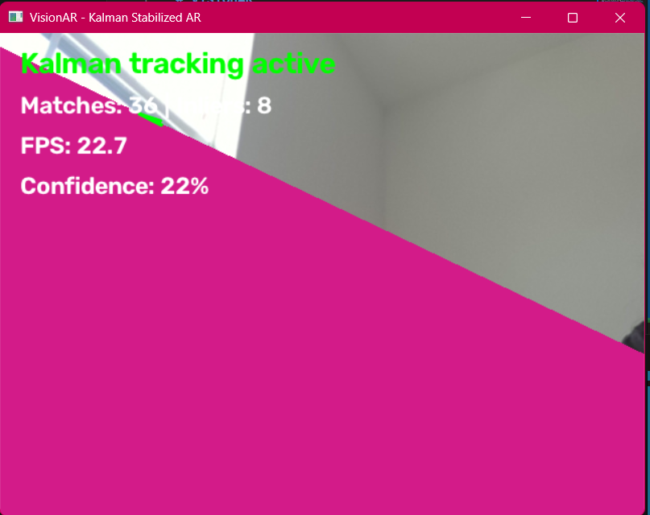
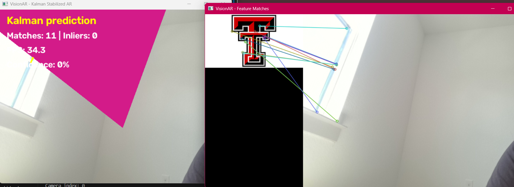

# VisionAR

[](https://github.com/saxenap2804/VisionAR/actions/workflows/tests.yml)

**Real-time marker-based Augmented Reality built with Python, OpenCV, NumPy, ORB feature detection, RANSAC homography estimation, 3D projection, and Kalman filtering.**

VisionAR detects a reference image through a webcam, estimates its perspective and orientation, and renders a 3D OBJ model on top of the tracked surface in real time.

The system includes Kalman-filter-based tracking stabilization, RANSAC confidence estimation, real-time performance monitoring, configurable CLI controls, automated testing, and GitHub Actions continuous integration.

---

## Features

- Real-time webcam-based augmented reality
- ORB feature detection and description
- Descriptor-based feature matching
- RANSAC-based outlier rejection
- Homography estimation
- Perspective-aware marker tracking
- Camera projection estimation
- Custom OBJ model loading
- Real-time 3D model rendering
- Kalman-filter-based corner stabilization
- Temporary tracking prediction when detection is lost
- RANSAC inlier-based confidence estimation
- Real-time FPS monitoring
- Marker boundary visualization
- ORB feature-match visualization
- Configurable command-line interface
- Automated unit tests with pytest
- GitHub Actions continuous integration

---

## Demo

### Real-Time Augmented Reality Tracking

VisionAR detects the reference marker from the webcam feed, estimates its perspective, stabilizes the detected marker corners using a Kalman filter, and projects a 3D OBJ model onto the tracked surface.



The real-time interface displays:

- Current tracking status
- ORB feature-match count
- RANSAC inlier count
- Tracking confidence
- Processing FPS
- Optional marker boundary

Run the AR tracker with the marker boundary enabled:

```bash
python src/main.py --rectangle --scale 4
```

### ORB Feature Matching

VisionAR includes a debugging mode that visualizes feature correspondences between the reference marker and the live webcam frame.



Run feature-match visualization:

```bash
python src/main.py --matches
```

Run the complete debugging view:

```bash
python src/main.py --matches --rectangle --scale 4
```

This visualization helps inspect whether ORB is identifying reliable correspondences before RANSAC estimates the marker homography.

---

## Computer Vision Pipeline

```text
Reference Marker
      |
      v
ORB Feature Detection
      |
      v
Feature Descriptors
      |
      +----------------------+
                             |
Webcam Frame                 |
      |                      |
      v                      |
ORB Feature Detection        |
      |                      |
      v                      |
Feature Matching <-----------+
      |
      v
RANSAC
      |
      v
Homography Estimation
      |
      v
Marker Corner Detection
      |
      v
Kalman Filter
(Predict + Correct)
      |
      v
Smoothed Marker Corners
      |
      v
Filtered Homography
      |
      v
Camera Projection Matrix
      |
      v
3D OBJ Projection
      |
      v
Augmented Reality Frame
```

---

## Tech Stack

| Technology | Purpose |
|---|---|
| Python | Core application |
| OpenCV | Computer vision, feature detection, and rendering |
| NumPy | Matrix and numerical operations |
| ORB | Feature detection and binary descriptors |
| RANSAC | Robust homography estimation and outlier rejection |
| Kalman Filter | Marker tracking stabilization and prediction |
| OBJ | 3D model representation |
| pytest | Automated testing |
| GitHub Actions | Continuous integration |

---

## Project Structure

```text
VisionAR/
|
├── .github/
│   └── workflows/
│       └── tests.yml
|
├── assets/
│   ├── markers/
│   │   └── marker.png
│   │
│   └── models/
│       └── model.obj
|
├── docs/
│   └── demo/
│       ├── tracking.png
│       └── matches.png
|
├── src/
│   ├── detector.py
│   ├── homography.py
│   ├── kalman.py
│   ├── main.py
│   ├── matcher.py
│   ├── obj_loader.py
│   ├── pose_estimator.py
│   ├── projection.py
│   └── renderer.py
|
├── tests/
│   ├── test_homography.py
│   ├── test_kalman.py
│   └── test_obj_loader.py
|
├── requirements.txt
└── README.md
```

---

## Installation

### 1. Clone the repository

```bash
git clone https://github.com/saxenap2804/VisionAR.git
cd VisionAR
```

### 2. Create a virtual environment

#### Windows

```bash
python -m venv .venv
.venv\Scripts\activate
```

#### macOS/Linux

```bash
python3 -m venv .venv
source .venv/bin/activate
```

### 3. Install dependencies

```bash
pip install -r requirements.txt
```

---

## Usage

### Start VisionAR

Run the application using the default marker, model, scale, and webcam:

```bash
python src/main.py
```

Press **Q** while the AR window is active to exit.

### Draw the Marker Boundary

```bash
python src/main.py --rectangle
```

### Display ORB Feature Matches

```bash
python src/main.py --matches
```

### Change the 3D Model Scale

```bash
python src/main.py --scale 5
```

### Enable Multiple Options

```bash
python src/main.py --matches --rectangle --scale 4
```

### Use a Different Marker

```bash
python src/main.py --marker path/to/marker.png
```

### Use a Different OBJ Model

```bash
python src/main.py --model path/to/model.obj
```

### Select Another Camera

```bash
python src/main.py --camera 1
```

### Display CLI Help

```bash
python src/main.py --help
```

---

## Command-Line Options

| Option | Description | Default |
|---|---|---|
| `--marker` | Path to the reference marker image | `assets/markers/marker.png` |
| `--model` | Path to the OBJ model | `assets/models/model.obj` |
| `--scale` | Scale factor for the rendered model | `3.0` |
| `--camera` | Camera device index | `0` |
| `--rectangle` | Display tracked marker boundary | Disabled |
| `--matches` | Display ORB feature correspondences | Disabled |
| `-h`, `--help` | Display command-line help | — |

---

## How It Works

### 1. ORB Feature Detection

VisionAR first detects distinctive keypoints in the reference marker using ORB (Oriented FAST and Rotated BRIEF).

ORB generates binary descriptors around those keypoints so they can be efficiently compared with features detected in incoming webcam frames.

The reference marker only needs to be processed once when the application starts.

### 2. Feature Matching

For every webcam frame, VisionAR detects another set of ORB features.

Descriptors from the reference marker are compared with descriptors from the current frame to identify candidate feature correspondences.

The strongest matches are passed to the geometric estimation stage.

### 3. RANSAC and Homography Estimation

Feature matching can produce incorrect correspondences.

VisionAR therefore uses RANSAC during homography estimation to reject geometrically inconsistent matches.

The resulting homography describes the perspective transformation between the original planar marker and its detected position in the webcam frame.

This allows VisionAR to determine where the marker's four corners appear in the live image.

### 4. Kalman Filter Stabilization

Raw frame-by-frame marker detections can introduce visible jitter.

VisionAR uses a constant-velocity Kalman filter to track the eight coordinates representing the four marker corners:

```text
x1, y1
x2, y2
x3, y3
x4, y4
```

The complete Kalman state contains both position and velocity:

```text
[x1, y1, x2, y2, x3, y3, x4, y4,
 vx1, vy1, vx2, vy2, vx3, vy3, vx4, vy4]
```

Each frame performs:

```text
Previous State
      |
      v
Prediction
      |
      v
Current Marker Measurement
      |
      v
Correction
      |
      v
Smoothed Corner Positions
```

The corrected corner coordinates are then used to calculate a new filtered homography.

If marker detection is temporarily lost, the Kalman motion model can continue predicting the marker's location for short periods.

### 5. Camera Projection

VisionAR constructs an approximate camera intrinsic matrix using the dimensions of the webcam frame.

The filtered homography and camera matrix are then used to calculate the projection matrix required for the AR rendering stage.

### 6. OBJ Model Loading

VisionAR includes a custom OBJ loader.

The loader reads:

- 3D vertex coordinates
- Polygon face definitions
- Face-to-vertex relationships

This allows standard `.obj` geometry to be loaded without requiring a complete external 3D engine.

### 7. 3D Rendering

The OBJ vertices are transformed using the calculated projection matrix.

The resulting 2D coordinates are projected onto the webcam image, and the model faces are rendered directly using OpenCV.

The final result is a 3D object visually anchored to the tracked reference marker.

---

## Real-Time Tracking Metrics

VisionAR displays tracking and performance information while the application is running.

Example:

```text
Kalman tracking active
Matches: 47 | Inliers: 36
FPS: 29.8
Confidence: 76%
```

### Matches

The number of feature correspondences found between the reference marker and the current webcam frame.

### Inliers

The number of candidate matches accepted by RANSAC as geometrically consistent with the estimated homography.

### Tracking Confidence

The confidence indicator is calculated using the RANSAC inlier ratio:

```text
confidence = number of inliers / number of evaluated matches
```

For example:

```text
36 inliers / 47 evaluated matches ≈ 76%
```

The displayed value is intended as a practical tracking-quality indicator rather than a statistically calibrated probability.

### FPS

FPS reports the approximate real-time processing throughput of the computer-vision pipeline.

The displayed value is smoothed between frames to reduce visual fluctuation.

---

## Tracking States

VisionAR can display different tracking states.

### `Kalman tracking active`

The marker was successfully detected in the current frame.

The Kalman filter performs both prediction and correction using the new measurement.

### `Kalman prediction`

The marker was not successfully detected in the current frame, but the Kalman filter has previously been initialized.

The system temporarily predicts the marker location using the estimated motion state.

### `Marker not detected`

The marker has not yet been successfully detected and the Kalman filter cannot provide a prediction.

---

## Testing

VisionAR includes automated tests for core mathematical, tracking, and model-loading components.

Run all tests:

```bash
pytest tests -v
```

The current test suite contains **12 automated tests**.

### Kalman Filter Tests

Tests verify:

- Filter initialization
- Prediction output
- Correction toward new measurements
- Reset behavior

### Homography Tests

Tests verify:

- Identity homography
- Translation transformations
- Insufficient-match handling

### OBJ Loader Tests

Tests verify:

- OBJ model loading
- Vertex count
- Face count
- 3D vertex structure
- Valid face indices

Expected result:

```text
12 passed
```

---

## Continuous Integration

VisionAR uses GitHub Actions for continuous integration.

The workflow automatically installs the project dependencies and executes the pytest suite whenever code is:

- pushed to `main`
- submitted through a pull request targeting `main`

Workflow:

```text
Git Push / Pull Request
          |
          v
GitHub Actions
          |
          v
Python Environment
          |
          v
Install Dependencies
          |
          v
Run pytest
          |
          v
12 Automated Tests
```

The status badge at the top of this README reflects the current CI result.

---

## Design Goals

VisionAR was developed around several engineering goals:

**Real-time performance**  
The tracking pipeline needs to operate continuously on webcam frames.

**Robust feature tracking**  
RANSAC reduces the effect of incorrect feature correspondences.

**Stable augmentation**  
Kalman filtering reduces visible frame-to-frame jitter.

**Modularity**  
Feature detection, matching, homography estimation, tracking, projection, OBJ loading, and rendering are separated into independent modules.

**Configurability**  
Markers, models, camera devices, rendering scale, and debugging visualizations can be controlled through CLI arguments.

**Testability**  
Core mathematical and parsing components can be tested independently of the webcam.

---

## Limitations

The current implementation is a lightweight AR proof of concept and has several known limitations:

- Camera intrinsics are approximated rather than obtained through full camera calibration.
- Tracking depends on a sufficiently feature-rich planar reference marker.
- Extreme motion blur can reduce ORB matching quality.
- Significant occlusion can interrupt marker detection.
- The renderer provides basic OBJ geometry rendering rather than a complete 3D graphics pipeline.
- Kalman prediction is designed primarily for short detection interruptions.
- Lighting and texture rendering are intentionally minimal.

---

## Future Improvements

Potential extensions include:

- Camera calibration using measured intrinsic parameters
- Multi-marker tracking
- Markerless feature tracking
- Texture-mapped OBJ models
- Improved lighting and shading
- GPU-accelerated feature processing
- Automatic 3D model selection
- Improved occlusion handling
- Full 6-DoF pose smoothing
- Better tracking-loss recovery
- AR scene recording
- Additional detector and matcher benchmarks
- Expanded automated test coverage

---

## Development Status

Core VisionAR pipeline:

- [x] Webcam capture
- [x] ORB feature detection
- [x] Feature matching
- [x] RANSAC outlier rejection
- [x] Homography estimation
- [x] Marker tracking
- [x] Camera projection
- [x] OBJ loading
- [x] Real-time 3D rendering
- [x] Kalman stabilization
- [x] Tracking-loss prediction
- [x] FPS monitoring
- [x] RANSAC confidence indicator
- [x] CLI configuration
- [x] Feature-match debugging
- [x] Automated tests
- [x] GitHub Actions CI
- [x] Demo screenshots

---

## License

No software license has been specified yet.

---

## Author

**Priyanka Saxena**

M.S. Computer Science  
Texas Tech University

GitHub: `saxenap2804`